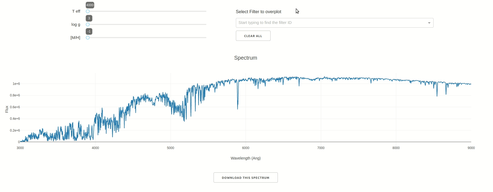

# StarKit Web Apps

Analytical web interfaces to actualize the power of StarKit! These interactive dashboards made using [Dash](https://github.com/plotly/dash), aim to make the analysis process easier and faster.

Dashboard for spectral analysis currently supports following functionalities:

## Analysing spectrum

You can determine spectrum at various values of grid parameters using sliders (a [Phoenix test grid](https://zenodo.org/record/2557923) is used in below example). You may even download the spectrum at selected parameters as CSV, by clicking the download button.

## Overplotting filter curves on spectrum

You can also plot filter transmission curves over spectrum, by selecting filter ID from the dropdown. Each filter curve is scaled up to roughly same height of spectrum, while plotting it using [wsynphot](https://github.com/starkit/wsynphot).

> **NOTE:** The web app deployment (url in repo description) may not be up-to-date with production (i.e. in screencasts).
